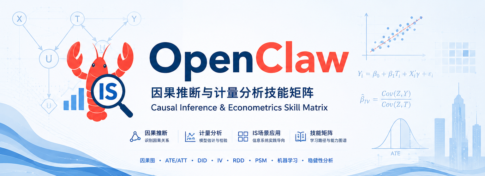

# IS-Econometrics Skills



**面向管理信息系统（IS）专业师生的因果推断与计量分析 OpenClaw 技能矩阵**

[](https://docs.openclaw.ai)
[](https://opensource.org/licenses/MIT)

## 🎯 目标

用户上传数据（.dta/.csv/.xlsx）并提出分析需求 → 全自动完成从数据探查到因果推断再到发表级表格输出。

```
用户: "分析这个面板数据，做双向固定效应回归，检验内生性"
  │
  ▼
is-econometrics (主控技能)
  │  识别意图 → panel-regression + iv-estimator
  │
  ▼
panel-regression ──→ TWFE 回归结果 (pickle)
iv-estimator    ──→ 2SLS 诊断报告 (pickle)
  │
  ▼
stargazer-exporter ──→ LaTeX/HTML/Word 发表级表格
```

## 📦 技能清单

| 技能 | 功能 | 触发关键词 |
|------|------|------------|
| **[is-econometrics](skills/is-econometrics/)** | 主控入口，协调所有子技能 | "因果推断"、"计量分析"、"回归分析" |
| **[panel-regression](skills/panel-regression/)** | 双向固定效应（TWFE）面板回归 | "面板回归"、"固定效应"、"TWFE"、"聚类标准误" |
| **[iv-estimator](skills/iv-estimator/)** | 2SLS 工具变量回归与内生性诊断 | "工具变量"、"2SLS"、"IV"、"Hausman"、"Sargan" |
| **[staggered-did](skills/staggered-did/)** | 多时点 DID（Callaway-Sant'Anna 估计量） | "多时点DID"、"Staggered DID"、"事件研究"、"平行趋势" |
| **[stargazer-exporter](skills/stargazer-exporter/)** | 学术表格格式化输出 | "输出表格"、"LaTeX"、"三线表"、"发表级" |

## 🔧 安装依赖

```bash
# 核心依赖
pip install linearmodels pandas pyreadstat

# 多时点 DID（可选）
pip install moderndid plotnine

# 表格导出（可选）
pip install stargazer python-docx
```

## 📥 安装技能

### 方式一：从 ClawHub 安装（推荐）

```bash
openclaw skill install is-econometrics
openclaw skill install panel-regression
openclaw skill install iv-estimator
openclaw skill install staggered-did
openclaw skill install stargazer-exporter
```

### 方式二：本地 .skill 文件安装

```bash
openclaw skill install ./dist/is-econometrics.skill
openclaw skill install ./dist/iv-estimator.skill
openclaw skill install ./dist/panel-regression.skill
openclaw skill install ./dist/staggered-did.skill
openclaw skill install ./dist/stargazer-exporter.skill
```

## 🚀 快速开始

### 1. 准备数据

将面板数据保存为 `.dta`、`.csv` 或 `.xlsx` 格式，包含：
- 个体 ID 列（如 `firm_id`）
- 时间 ID 列（如 `year`）
- 因变量（如 `roa`）
- 解释变量（如 `it_investment_g`、`co_size_ln`）

### 2. 对话示例

```
用户: 我有一个企业面板数据 DTA 文件，想分析数字化转型对企业绩效的影响

智能体: 好的，我来帮你完成这个因果推断分析。让我先探查数据结构...

[自动执行]
1. 探查 DTA 元数据（变量标签、样本量）
2. 执行双向固定效应回归
3. 检验内生性问题（如需要，调用工具变量回归）
4. 输出发表级 LaTeX 表格
```

### 3. 单独使用子技能

```bash
# 面板回归
用户: 用企业规模、资产负债率、年龄作为控制变量，对 roa 做双向固定效应回归

# 工具变量
用户: 检验 IT 投资的内生性，使用政府信息化采购和数字基础设施作为工具变量

# 多时点 DID
用户: 分析2018-2022年企业数字化转型对绩效的多时点DID效应，生成平行趋势图
```

## 📊 核心功能

### Panel Regression（双向固定效应回归）

```bash
python skills/panel-regression/scripts/panel_regression.py \
  --data "./data/enterprise_panel.dta" \
  --y "roa" \
  --x "it_investment_g co_size_ln lev age" \
  --entity "firm_id" \
  --time "year" \
  --cluster "entity" \
  --output_pickle "./output/panel_results.pkl"
```

输出：
- 企业层面聚类稳健标准误
- VIF 共线性诊断
- R² (within) 与 F 统计量
- 固定效应状态行

### IV Estimator（工具变量回归）

```bash
python skills/iv-estimator/scripts/iv_regression.py \
  --data "./data/enterprise_panel.dta" \
  --y "roa" \
  --exog "co_size_ln lev age" \
  --endog "it_investment_g" \
  --iv "ln_gov_proc digital_infrastructure" \
  --output_pickle "./output/iv_results.pkl"
```

诊断：
- 第一阶段偏 F 统计量（弱工具变量检验）
- Durbin-Wu-Hausman 内生性检验
- Hansen J 过度识别检验

### Staggered DID（多时点双重差分）

```bash
python skills/staggered-did/scripts/staggered_did_pipeline.py \
  --data "./data/digitalization_panel.dta" \
  --y "roa" \
  --t "year" \
  --id "firm_id" \
  --g "first_adoption_year" \
  --cov "~ co_size_ln + lev + age" \
  --control_group "notyettreated" \
  --est_method "dr" \
  --output_pickle "./output/did_results.pkl" \
  --plot_path "./output/event_study_plot.png"
```

输出：
- 群组-时间 ATT(g,t) 估计
- 事件研究法聚合结果
- 总体 ATT 与置信区间
- 平行趋势检验图（PNG）

### Stargazer Exporter（学术表格输出）

```bash
python skills/stargazer-exporter/scripts/generate_table.py \
  --pickles "./output/panel_results.pkl" "./output/iv_results.pkl" \
  --models "双向固定效应" "工具变量回归" \
  --rename "it_investment_g:IT投资,co_size_ln:企业规模,roa:企业绩效" \
  --title "表1：数字化转型对企业绩效的影响" \
  --output_dir "./output" \
  --formats "latex,html,docx"
```

输出格式：
- LaTeX（Overleaf/ShareLaTeX）
- HTML（网络附件）
- Word（论文章节）

## 📁 项目结构

```
is-econometrics-skills/
├── README.md
├── OpenClaw_README_banner.png     # README 顶部背景图
├── OpenClaw_repo_icon_card.png    # 仓库图标卡片
├── skills/
│   ├── is-econometrics/        # 主控技能（协调层）
│   │   └── SKILL.md
│   ├── panel-regression/       # 双向固定效应回归
│   │   ├── SKILL.md
│   │   ├── scripts/
│   │   │   └── panel_regression.py
│   │   └── references/
│   │       └── panel-regression-guide.md
│   ├── iv-estimator/           # 工具变量回归
│   │   ├── SKILL.md
│   │   ├── scripts/
│   │   │   └── iv_regression.py
│   │   └── references/
│   │       └── iv-diagnostics.md
│   ├── staggered-did/          # 多时点 DID
│   │   ├── SKILL.md
│   │   ├── scripts/
│   │   │   └── staggered_did_pipeline.py
│   │   └── references/
│   │       └── staggered-did-guide.md
│   └── stargazer-exporter/     # 表格导出
│       ├── SKILL.md
│       ├── scripts/
│       │   └── generate_table.py
│       └── references/
│           └── default_rename_map.md
└── dist/                       # 打包的 .skill 文件
    ├── is-econometrics.skill
    ├── panel-regression.skill
    ├── iv-estimator.skill
    ├── staggered-did.skill
    └── stargazer-exporter.skill
```

## 🔒 安全说明

- 所有数据分析在沙盒环境运行，敏感数据不外传
- 默认只读模式，禁止自动删除文件
- 高风险操作（如 exec）默认需人工确认
- 建议配合 Docker 沙盒模式（`sandbox.mode: all`）使用

## 📚 学术引用

若在学术研究中使用这些技能，建议引用：

> 万院士 (2026). IS-Econometrics: 面向信息系统专业的因果推断与计量分析 OpenClaw 技能矩阵. GitHub Repository.

相关计量方法论：

- Callaway, B., & Sant'Anna, P. H. (2021). "Difference-in-differences with multiple time periods." *Journal of Econometrics*.
- Stock, J. H., & Yogo, M. (2005). "Testing for weak instruments in linear IV regression."
- Wooldridge, J. M. (2010). *Econometric Analysis of Cross Section and Panel Data*.

## 🤝 贡献

欢迎提交 Issue 和 Pull Request！请确保：
1. 新技能符合 OpenClaw Skill 规范
2. 所有 Python 脚本通过语法检查
3. SKILL.md 通过 `quick_validate.py` 验证

## 📄 License

MIT License